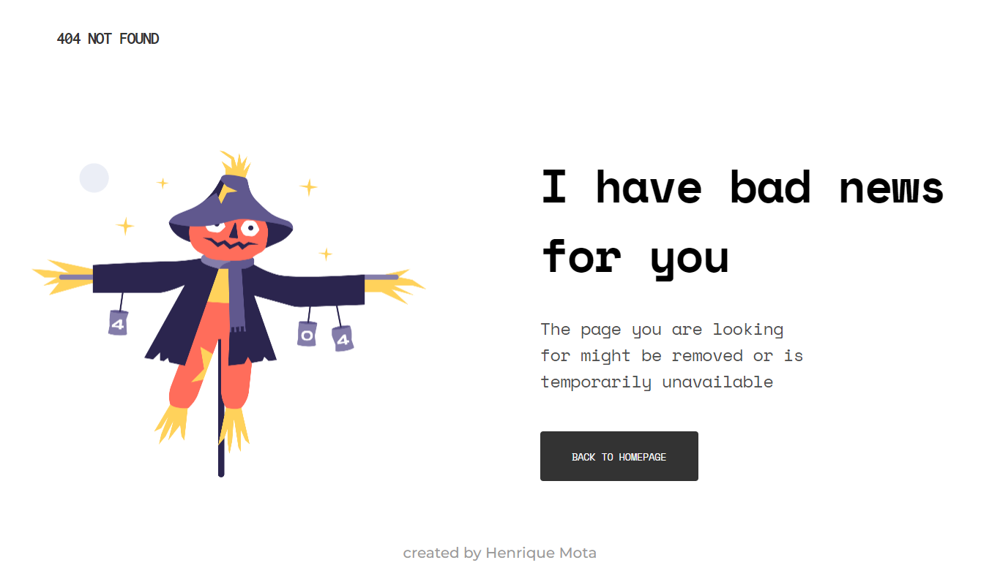
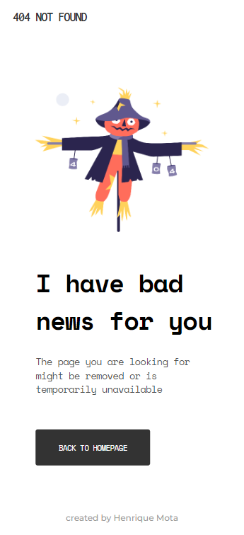

<h1 align="center">404 Page</h1>

   Solução para desafio da  <a href="http://devchallenges.io" target="_blank">Devchallenges.io</a>.

  <h3>
    <a href="https://{your-demo-link.your-domain}">
      Demo
    </a>
     | 
    <a href="https://rikimota.github.io/404-not-found/" target="_blank>
      Solução
    </a>
     | 
    <a href="https://devchallenges.io/challenges/wBunSb7FPrIepJZAg0sY">
      Desafio
    </a>
  </h3>

## Table of Contents

- [Overview](#overview)
  - [Built With](#built-with)
- [Features](#features)
- [Contact](#contact)
- [Acknowledgements](#acknowledgements)

## Overview

 

- DEMO: [here]()

### Built With

- [HTML](https://developer.mozilla.org/pt-BR/docs/Web/HTML)
- [CSS](https://developer.mozilla.org/pt-BR/docs/Web/CSS)

## Features

Este site foi criado com submissão para o desafio [DevChallenges](https://devchallenges.io/challenges). O [desafio](https://devchallenges.io/challenges/wBunSb7FPrIepJZAg0sY) era refazer o site como foi proposto no projeto do desafio.

## Acknowledgements

- [Replicar um design utilizando apenas HTML e CSS](https://devchallenges-blogs.web.app/how-to-replicate-design/)
- [Marked - a markdown parser](https://github.com/chjj/marked)

## Contact

- GitHub [@rikimota](https://github.com/rikimota)
- Instagram [@riki.mota](https://www.instagram.com/riki.mota/)
- Email [rikimotaa@gmail.com]()
